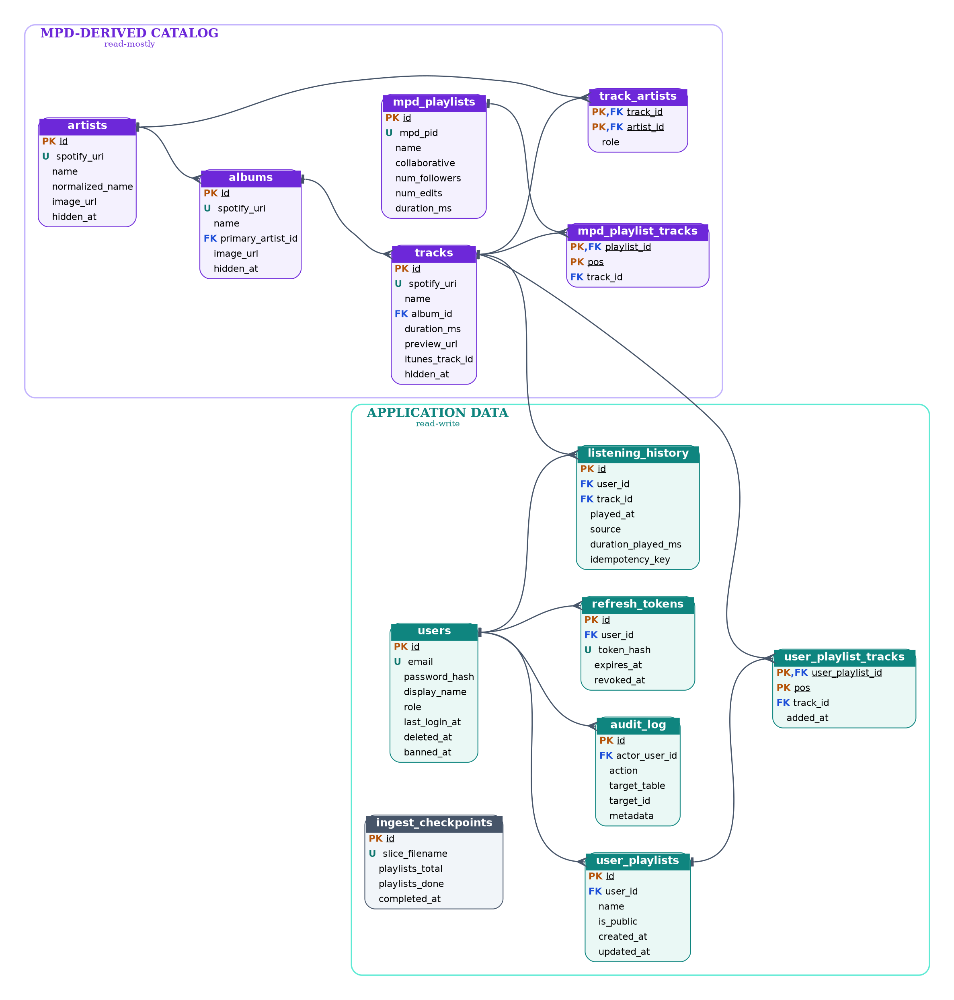
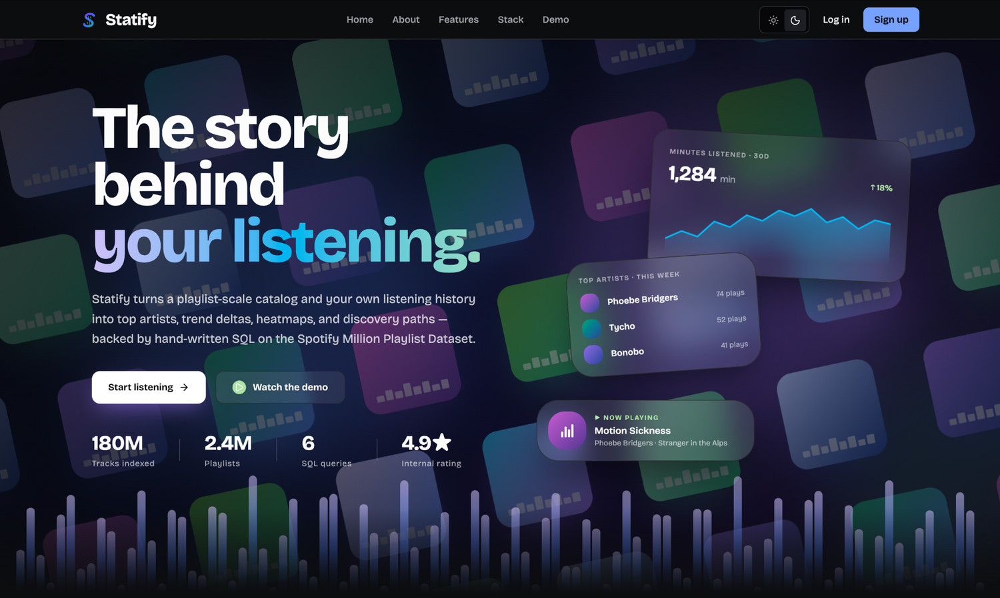
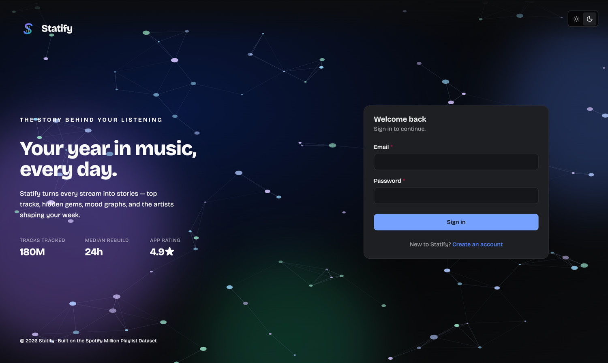
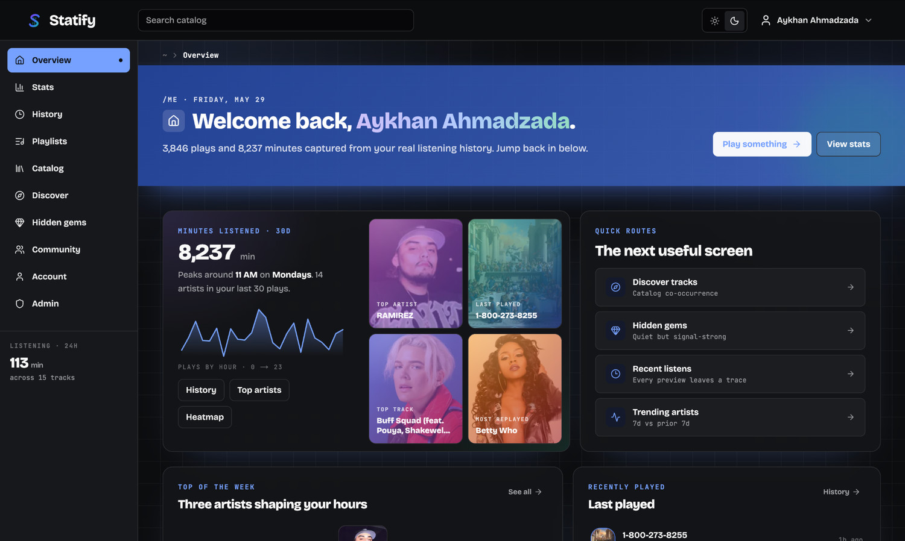
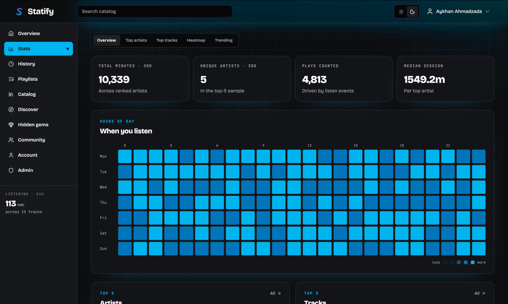
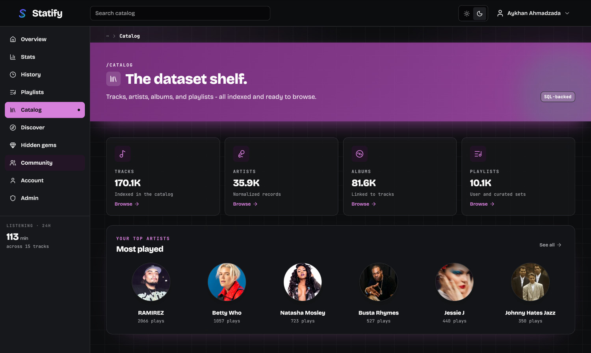
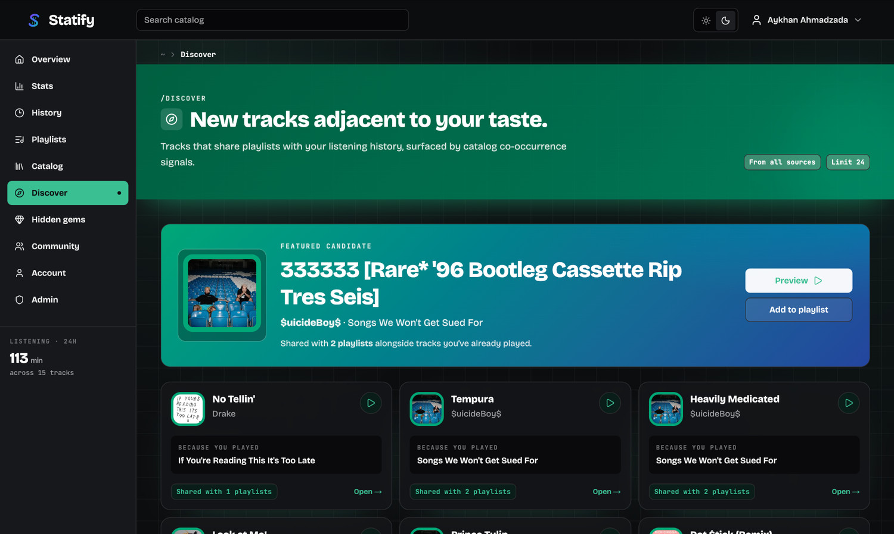
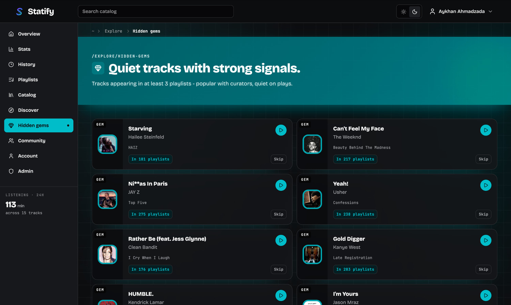

# Statify

### Music Streaming Analytics on the Spotify Million Playlist Dataset

**Final Project Report - COMP 306 - Database Management Systems**

|                |                                                                      |
| -------------- | -------------------------------------------------------------------- |
| **Team**       | Aykhan Ahmadzada, Elshad Toklayev, Rahila Dashdiyeva, Eljan Mammadli |
| **Date**       | May 2026                                                             |
| **Repository** | https://github.com/aykhan019/statify                                 |
| **Stack**      | Next.js - NestJS - PostgreSQL 16 - Prisma - Neon - Vercel - Render   |

---

## 1. Project Description

Statify is a full-stack music-analytics application that turns a playlist-scale catalog and a listener's own play history into readable insight: top artists and tracks, listening trends, hour-of-day heatmaps, playlist-based discovery, and "hidden gems".

The catalog is derived from the Spotify Million Playlist Dataset and stored in a normalized PostgreSQL database. A NestJS API serves it to a Next.js web client, and the database does the analytical heavy lifting: every ranking, trend, and recommendation in the product is computed with SQL rather than in application code.

### What a listener can do

- Browse a normalized catalog of artists, albums, tracks, and curated playlists, with trigram-backed fuzzy search.
- Play 30-second previews in-app; every preview is recorded, building the listening history that powers the analytics screens.
- See a personal overview and a detailed Stats page: minutes listened, top artists and tracks, a weekday-by-hour heatmap, and week-over-week trends.
- Create and manage public or private playlists, and explore a community view of what other listeners share.
- Discover new music through playlist co-occurrence, and find under-played "hidden gems" that curators favour.

### How the database underpins it

Listening history is stored one row per play and aggregated for top-N rankings, heatmaps, and trend deltas. The many-to-many playlist-track tables drive co-occurrence discovery and hidden-gem detection. An audit log records privileged administrative actions, and resumable ingest checkpoints track dataset loading. Soft-delete and moderation columns (`deleted_at`, `banned_at`, `hidden_at`) let administrators hide content and manage accounts without destructive deletes. Authentication uses email and password with Argon2 hashing, short-lived JWT access tokens, and rotating httpOnly refresh tokens.

---

## 2. Entity-Relationship Diagram

The diagram below is generated from the live production schema in crow's-foot notation. It comprises the thirteen application tables, grouped into two domains: a read-mostly **catalog** derived from the Million Playlist Dataset, and the read-write **application** data created by listeners and administrators. `tracks` and `users` are the two hubs that nearly every relationship passes through.



_Figure 1. Statify relational schema (13 tables) in crow's-foot notation. PK = primary key, FK = foreign key, U = unique constraint._

---

## 3. Relational Database Design

The schema is defined and migrated with Prisma against PostgreSQL 16. The statements below are the logical DDL for the thirteen tables, three enumerated domains, and the indexes that matter for performance.

### Types and extensions

```sql
-- Enumerated domains
CREATE TYPE listening_source  AS ENUM ('preview', 'seed');
CREATE TYPE track_artist_role AS ENUM ('primary', 'featured');
CREATE TYPE user_role         AS ENUM ('user', 'admin');

-- Trigram search support (backs the GIN indexes below)
CREATE EXTENSION IF NOT EXISTS pg_trgm;
```

### Catalog tables (MPD-derived)

These hold the dataset itself. Artists, albums, and tracks form a clean hierarchy; `track_artists` resolves the many-to-many between tracks and artists, and the `mpd_*` tables store the original playlists and their ordered track lists.

**`artists`**

```sql
CREATE TABLE artists (
    id              serial       PRIMARY KEY,
    spotify_uri     text         NOT NULL UNIQUE,
    name            text         NOT NULL,
    normalized_name text         NOT NULL,
    image_url       text,
    hidden_at       timestamp(3),
    created_at      timestamp(3) NOT NULL DEFAULT CURRENT_TIMESTAMP
);
```

**`albums`**

```sql
CREATE TABLE albums (
    id                serial       PRIMARY KEY,
    spotify_uri       text         NOT NULL UNIQUE,
    name              text         NOT NULL,
    primary_artist_id integer      NOT NULL REFERENCES artists(id) ON UPDATE CASCADE ON DELETE RESTRICT,
    image_url         text,
    hidden_at         timestamp(3),
    created_at        timestamp(3) NOT NULL DEFAULT CURRENT_TIMESTAMP
);
```

**`tracks`**

```sql
CREATE TABLE tracks (
    id                 serial       PRIMARY KEY,
    spotify_uri        text         NOT NULL UNIQUE,
    name               text         NOT NULL,
    album_id           integer      NOT NULL REFERENCES albums(id) ON UPDATE CASCADE ON DELETE RESTRICT,
    duration_ms        integer      NOT NULL,
    itunes_track_id    bigint,
    preview_url        text,
    preview_fetched_at timestamp(3),
    image_url          text,
    hidden_at          timestamp(3)
);
```

**`track_artists`**

```sql
CREATE TABLE track_artists (
    track_id  integer           NOT NULL REFERENCES tracks(id)  ON UPDATE CASCADE ON DELETE RESTRICT,
    artist_id integer           NOT NULL REFERENCES artists(id) ON UPDATE CASCADE ON DELETE RESTRICT,
    role      track_artist_role NOT NULL DEFAULT 'primary',
    PRIMARY KEY (track_id, artist_id)
);
```

**`mpd_playlists`**

```sql
CREATE TABLE mpd_playlists (
    id            serial       PRIMARY KEY,
    mpd_pid       integer      NOT NULL UNIQUE,
    name          text         NOT NULL,
    collaborative boolean      NOT NULL DEFAULT false,
    modified_at   timestamp(3) NOT NULL,
    num_followers integer      NOT NULL,
    num_edits     integer      NOT NULL,
    duration_ms   bigint       NOT NULL
);
```

**`mpd_playlist_tracks`**

```sql
CREATE TABLE mpd_playlist_tracks (
    playlist_id integer NOT NULL REFERENCES mpd_playlists(id) ON UPDATE CASCADE ON DELETE RESTRICT,
    track_id    integer NOT NULL REFERENCES tracks(id)        ON UPDATE CASCADE ON DELETE RESTRICT,
    pos         integer NOT NULL,
    PRIMARY KEY (playlist_id, pos)
);
```

### Application tables (read-write)

These capture everything created inside the product: accounts and sessions, recorded plays, user playlists, the moderation audit trail, and ingestion bookkeeping.

**`users`**

```sql
CREATE TABLE users (
    id            serial       PRIMARY KEY,
    email         text         NOT NULL UNIQUE,
    password_hash text         NOT NULL,
    display_name  text         NOT NULL,
    role          user_role    NOT NULL DEFAULT 'user',
    created_at    timestamp(3) NOT NULL DEFAULT CURRENT_TIMESTAMP,
    last_login_at timestamp(3),
    deleted_at    timestamp(3),
    banned_at     timestamp(3)
);
```

**`refresh_tokens`**

```sql
CREATE TABLE refresh_tokens (
    id         serial       PRIMARY KEY,
    user_id    integer      NOT NULL REFERENCES users(id) ON UPDATE CASCADE ON DELETE RESTRICT,
    token_hash text         NOT NULL UNIQUE,
    expires_at timestamp(3) NOT NULL,
    revoked_at timestamp(3),
    user_agent text,
    ip_addr    text,
    created_at timestamp(3) NOT NULL DEFAULT CURRENT_TIMESTAMP
);
```

**`listening_history`**

```sql
CREATE TABLE listening_history (
    id                 serial            PRIMARY KEY,
    user_id            integer           NOT NULL REFERENCES users(id)  ON UPDATE CASCADE ON DELETE RESTRICT,
    track_id           integer           NOT NULL REFERENCES tracks(id) ON UPDATE CASCADE ON DELETE RESTRICT,
    played_at          timestamp(3)      NOT NULL DEFAULT CURRENT_TIMESTAMP,
    source             listening_source  NOT NULL DEFAULT 'preview',
    duration_played_ms integer           NOT NULL,
    idempotency_key    text,
    UNIQUE (user_id, idempotency_key)
);
```

**`user_playlists`**

```sql
CREATE TABLE user_playlists (
    id          serial       PRIMARY KEY,
    user_id     integer      NOT NULL REFERENCES users(id) ON UPDATE CASCADE ON DELETE RESTRICT,
    name        text         NOT NULL,
    description text,
    is_public   boolean      NOT NULL DEFAULT false,
    created_at  timestamp(3) NOT NULL DEFAULT CURRENT_TIMESTAMP,
    updated_at  timestamp(3) NOT NULL
);
```

**`user_playlist_tracks`**

```sql
CREATE TABLE user_playlist_tracks (
    user_playlist_id integer      NOT NULL REFERENCES user_playlists(id) ON UPDATE CASCADE ON DELETE RESTRICT,
    track_id         integer      NOT NULL REFERENCES tracks(id)         ON UPDATE CASCADE ON DELETE RESTRICT,
    pos              integer      NOT NULL,
    added_at         timestamp(3) NOT NULL DEFAULT CURRENT_TIMESTAMP,
    PRIMARY KEY (user_playlist_id, pos)
);
```

**`audit_log`**

```sql
CREATE TABLE audit_log (
    id            serial       PRIMARY KEY,
    actor_user_id integer      REFERENCES users(id) ON UPDATE CASCADE ON DELETE SET NULL,
    action        text         NOT NULL,
    target_table  text         NOT NULL,
    target_id     text,
    metadata      jsonb,
    created_at    timestamp(3) NOT NULL DEFAULT CURRENT_TIMESTAMP
);
```

**`ingest_checkpoints`**

```sql
CREATE TABLE ingest_checkpoints (
    id               serial       PRIMARY KEY,
    slice_filename   text         NOT NULL UNIQUE,
    playlists_total  integer      NOT NULL,
    playlists_done   integer      NOT NULL DEFAULT 0,
    artists_upserted integer      NOT NULL DEFAULT 0,
    albums_upserted  integer      NOT NULL DEFAULT 0,
    tracks_upserted  integer      NOT NULL DEFAULT 0,
    started_at       timestamp(3) NOT NULL DEFAULT CURRENT_TIMESTAMP,
    completed_at     timestamp(3),
    error_message    text
);
```

### Indexes and search support

A curated set of the indexes that shape query plans: trigram GIN indexes for fuzzy name search, a partial index that isolates previewable tracks, descending composite indexes for newest-first feeds, and btree indexes on foreign keys and moderation columns.

```sql
-- Fuzzy catalog search (trigram GIN over names)
CREATE INDEX artists_name_trgm_idx ON artists USING gin (name gin_trgm_ops);
CREATE INDEX albums_name_trgm_idx  ON albums  USING gin (name gin_trgm_ops);
CREATE INDEX tracks_name_trgm_idx  ON tracks  USING gin (name gin_trgm_ops);

-- Partial index: only tracks that carry a playable preview
CREATE INDEX tracks_preview_url_not_null_idx
    ON tracks (id) WHERE preview_url IS NOT NULL;

-- Recency-ordered access paths (newest-first feeds)
CREATE INDEX listening_history_user_id_played_at_idx
    ON listening_history (user_id, played_at DESC);
CREATE INDEX audit_log_actor_user_id_created_at_idx
    ON audit_log (actor_user_id, created_at DESC);

-- Foreign-key / join support and moderation filters
CREATE INDEX tracks_album_id_idx          ON tracks (album_id);
CREATE INDEX albums_primary_artist_id_idx ON albums (primary_artist_id);
CREATE INDEX users_deleted_at_idx         ON users (deleted_at);
CREATE INDEX tracks_hidden_at_idx         ON tracks (hidden_at);
```

### Keys, relationships, and integrity

Ten tables use a single surrogate integer primary key. Three association tables use composite keys that also encode ordering or identity: `track_artists (track_id, artist_id)`, `mpd_playlist_tracks (playlist_id, pos)`, and `user_playlist_tracks (user_playlist_id, pos)`. Thirteen foreign keys connect the tables; all of them cascade on update. Deletes are `RESTRICT` so that referenced catalog and account rows cannot be orphaned, with one deliberate exception: `audit_log.actor_user_id` is `ON DELETE SET NULL`, so the moderation trail survives even if an actor's account is removed. Uniqueness is enforced where the data demands idempotency: `spotify_uri` on every catalog entity (so re-ingesting a slice cannot create duplicates), `email` and `token_hash` on the account tables, `mpd_pid` and `slice_filename` for the ingest pipeline, and the composite `(user_id, idempotency_key)` on `listening_history` to de-duplicate play events.

---

## 4. Data Sources

Statify combines a real public dataset with deterministic seed data that makes the analytics meaningful in a demo environment.

### The catalog

The catalog is built from the **Spotify Million Playlist Dataset**. The first ten MPD slices (10,000 playlists) were loaded through a custom, resumable ingest CLI that parses each slice's JSON, normalizes artists, albums, and tracks (de-duplicating by Spotify URI and computing a diacritic-stripped `normalized_name`), and batch-upserts them, recording progress per slice in `ingest_checkpoints`. Because the dataset ships only names and URIs, album and artist artwork (`image_url`) and playable track previews were backfilled from external music APIs: the iTunes Search API, the Spotify Web API, and Deezer.

### Application data

Accounts, listening history, and playlists combine real in-app activity with deterministic seed scripts. Listening history is generated as roughly 60,000 play events following a Zipf popularity distribution, so a small head of tracks is played heavily while a long tail is played lightly and "most played" rankings are non-degenerate; a handful of additional rows come from genuine preview plays. Community users and their public and private playlists are seeded similarly, and the operational tables (`refresh_tokens`, `audit_log`, `ingest_checkpoints`) are produced by ordinary application and ingestion activity.

### Row counts

_Production row counts, as of the database export on 29 May 2026._

| Table                        |          Rows | Contents                              |
| ---------------------------- | ------------: | ------------------------------------- |
| **Catalog - MPD-derived**    |               |                                       |
| `artists`                    |        35,892 | Distinct primary and featured artists |
| `albums`                     |        81,565 | Albums linked to tracks               |
| `tracks`                     |       170,089 | Tracks indexed from the dataset       |
| `track_artists`              |       170,089 | Track ↔ artist credits                |
| `mpd_playlists`              |        10,000 | MPD playlists (first 10 slices)       |
| `mpd_playlist_tracks`        |       664,712 | Playlist ↔ track memberships          |
| **Application - read-write** |               |                                       |
| `users`                      |            48 | Registered accounts                   |
| `refresh_tokens`             |           129 | Issued refresh tokens                 |
| `listening_history`          |        60,044 | Recorded play events                  |
| `user_playlists`             |           140 | User-created playlists                |
| `user_playlist_tracks`       |         2,810 | Tracks across user playlists          |
| `audit_log`                  |           176 | Recorded admin actions                |
| `ingest_checkpoints`         |            10 | Ingested dataset slices               |
| **Total**                    | **1,195,704** | **across 13 application tables**      |

---

## 5. Advanced SQL Queries

Five representative queries that power the product. Each is valid PostgreSQL against the schema above; in the running application the same logic is served by the API (via Prisma and parameterized raw SQL). Bind parameters such as `$1` carry the current listener's id.

### Q1. Top artists by play count

```sql
SELECT a.id,
       a.name,
       COUNT(*)                                            AS plays,
       COUNT(DISTINCT lh.track_id)                         AS distinct_tracks,
       ROUND(SUM(lh.duration_played_ms) / 60000.0, 1)      AS minutes,
       RANK()  OVER (ORDER BY COUNT(*) DESC)               AS rank,
       ROUND(100.0 * COUNT(*) / SUM(COUNT(*)) OVER (), 2)  AS pct_of_plays
FROM   listening_history lh
JOIN   track_artists ta ON ta.track_id = lh.track_id AND ta.role = 'primary'
JOIN   artists a        ON a.id = ta.artist_id
WHERE  lh.user_id = $1
  AND  lh.played_at >= now() - interval '30 days'
  AND  a.hidden_at IS NULL
GROUP  BY a.id, a.name
ORDER  BY plays DESC
LIMIT  10;
```

- **What it does:** Joins each play event to its primary artist, counts plays per artist over the last 30 days, and uses window functions to assign a dense ranking and each artist's share of total plays.
- **Why it is useful:** This is the core ranking behind the listener's profile. The nested `SUM(COUNT(*)) OVER ()` turns raw counts into percentages in a single pass, and filtering on `role = 'primary'` avoids double-counting featured credits.
- **In the product:** Powers **Most played** on the Catalog page (Figure 8) and the **Top artists** tab on Stats (Figure 5).

### Q2. Listening heatmap by weekday and hour

```sql
SELECT EXTRACT(DOW  FROM lh.played_at)::int AS dow,    -- 0 = Sunday .. 6 = Saturday
       EXTRACT(HOUR FROM lh.played_at)::int AS hour,   -- 0 .. 23
       COUNT(*)                             AS plays
FROM   listening_history lh
WHERE  lh.user_id = $1
  AND  lh.played_at >= now() - interval '90 days'
GROUP  BY dow, hour
ORDER  BY dow, hour;
```

- **What it does:** Buckets every play in the last 90 days by day-of-week and hour-of-day and counts how many fall in each of the 168 cells.
- **Why it is useful:** Returns the long form that the client pivots into a 7x24 grid, revealing when a listener is most active. Date-part extraction keeps the work in the database rather than pulling raw timestamps to the client.
- **In the product:** Renders the **When you listen** heatmap on the Stats page (Figure 5).

### Q3. Hidden gems: loved by playlists, quiet on plays

```sql
SELECT t.id,
       t.name,
       a.name                            AS artist,
       COUNT(DISTINCT mpt.playlist_id)   AS playlist_count,
       COALESCE(plays.cnt, 0)            AS your_plays
FROM   tracks t
JOIN   mpd_playlist_tracks mpt ON mpt.track_id = t.id
JOIN   track_artists ta        ON ta.track_id = t.id AND ta.role = 'primary'
JOIN   artists a               ON a.id = ta.artist_id
LEFT   JOIN (
           SELECT track_id, COUNT(*) AS cnt
           FROM   listening_history
           WHERE  user_id = $1
           GROUP  BY track_id
       ) plays ON plays.track_id = t.id
WHERE  t.hidden_at IS NULL
  AND  t.preview_url IS NOT NULL
GROUP  BY t.id, t.name, a.name, plays.cnt
HAVING COUNT(DISTINCT mpt.playlist_id) >= 3
   AND COALESCE(plays.cnt, 0) = 0
ORDER  BY playlist_count DESC
LIMIT  24;
```

- **What it does:** Counts how many MPD playlists each track appears in, left-joins the listener's own play counts, then keeps only tracks that sit in at least three playlists yet have never been played by the user.
- **Why it is useful:** Surfaces broadly endorsed but personally unheard tracks. The `LEFT JOIN` plus `HAVING ... = 0` is an anti-join that expresses "popular with curators, absent from your history", and the preview filter guarantees every result is playable.
- **In the product:** Drives the Hidden gems page (Figure 10), where each card shows the playlist count.

### Q4. Discovery by playlist co-occurrence

```sql
WITH seeds AS (                       -- tracks the listener has actually played
    SELECT DISTINCT track_id
    FROM   listening_history
    WHERE  user_id = $1
),
neighbours AS (                      -- MPD playlists those seed tracks live in
    SELECT DISTINCT mpt.playlist_id
    FROM   mpd_playlist_tracks mpt
    JOIN   seeds s ON s.track_id = mpt.track_id
)
SELECT t.id,
       t.name,
       a.name                          AS artist,
       COUNT(DISTINCT mpt.playlist_id) AS shared_playlists
FROM   mpd_playlist_tracks mpt
JOIN   neighbours n     ON n.playlist_id = mpt.playlist_id
JOIN   tracks t         ON t.id = mpt.track_id
JOIN   track_artists ta ON ta.track_id = t.id AND ta.role = 'primary'
JOIN   artists a        ON a.id = ta.artist_id
WHERE  t.hidden_at IS NULL
  AND  t.preview_url IS NOT NULL
  AND  t.id NOT IN (SELECT track_id FROM seeds)   -- exclude what they already know
GROUP  BY t.id, t.name, a.name
ORDER  BY shared_playlists DESC
LIMIT  24;
```

- **What it does:** A two-stage CTE: collect the tracks a listener has played (seeds), find the MPD playlists those seeds appear in (neighbours), then rank every other track in those playlists by how many of them it shares.
- **Why it is useful:** This is item-to-item collaborative filtering expressed in pure SQL: tracks that repeatedly co-occur with a listener's music in human-made playlists are strong recommendations. The seed set is reused to exclude already-played tracks.
- **In the product:** Generates the Discover feed (Figure 9): every candidate is annotated with the seed track and its shared-playlist count.

### Q5. Trending artists: last 7 days vs the previous 7

```sql
SELECT a.id,
       a.name,
       COUNT(*) FILTER (
           WHERE lh.played_at >= now() - interval '7 days')                 AS plays_7d,
       COUNT(*) FILTER (
           WHERE lh.played_at >= now() - interval '14 days'
             AND lh.played_at <  now() - interval '7 days')                 AS plays_prev_7d,
       COUNT(*) FILTER (WHERE lh.played_at >= now() - interval '7 days')
         - COUNT(*) FILTER (
             WHERE lh.played_at >= now() - interval '14 days'
               AND lh.played_at <  now() - interval '7 days')               AS delta
FROM   listening_history lh
JOIN   track_artists ta ON ta.track_id = lh.track_id AND ta.role = 'primary'
JOIN   artists a        ON a.id = ta.artist_id
WHERE  lh.user_id = $1
  AND  lh.played_at >= now() - interval '14 days'
  AND  a.hidden_at IS NULL
GROUP  BY a.id, a.name
HAVING COUNT(*) FILTER (WHERE lh.played_at >= now() - interval '7 days') > 0
ORDER  BY delta DESC
LIMIT  10;
```

- **What it does:** Uses filtered aggregates to count each artist's plays in the current week and the week before it, then computes the week-over-week change in one scan of the last fourteen days.
- **Why it is useful:** `COUNT(*) FILTER (WHERE ...)` compares two time windows without self-joins or subqueries, so the momentum (rising or fading) of each artist comes from a single, index-friendly pass.
- **In the product:** Backs **Trending artists - 7d vs prior 7d** on the Overview and Stats pages (Figures 4 and 5).

### Q6. Community: most-followed curated playlists

```sql
-- Curated MPD playlists, ranked by reach and weighted by how active they are
SELECT p.id,
       p.name,
       p.num_followers,
       p.num_edits,
       COUNT(mpt.track_id)                                   AS track_count,
       ROUND(p.duration_ms / 3600000.0, 1)                   AS hours,
       RANK() OVER (ORDER BY p.num_followers DESC)           AS follower_rank
FROM   mpd_playlists p
JOIN   mpd_playlist_tracks mpt ON mpt.playlist_id = p.id
GROUP  BY p.id, p.name, p.num_followers, p.num_edits, p.duration_ms
HAVING COUNT(mpt.track_id) >= 10        -- ignore thin or stub playlists
ORDER  BY p.num_followers DESC,
         p.num_edits DESC
LIMIT  12;
```

- **What it does:** Ranks the curated MPD playlists by follower count, joining in their track lists to report the size and total running time of each, and drops playlists with fewer than ten tracks so the leaderboard reflects substantial sets.
- **Why it is useful:** It turns the raw dataset's popularity signal (`num_followers`) into the editorial "curated picks" rail, and the `RANK()` window plus the `num_edits` tie-breaker give a stable ordering even when several playlists share a follower count.
- **In the product:** Powers the **Curated picks - Ranked by followers** section on the Community page (Figure 11).

---

## 6. Application Screenshots

A walk through the working prototype, from the public pages to the listener's analytics and the administrative console. Captions note the tables and queries behind each screen.

### The public surface



_Figure 2. The marketing landing page. The floating cards and hero figures preview the kind of personal insight the application produces once a listener signs in._



_Figure 3. Email-and-password sign-in. Credentials are verified against `users.password_hash` (Argon2); on success a short-lived JWT and an httpOnly refresh-token cookie are issued._

### Your listening at a glance



_Figure 4. The authenticated overview. Minutes listened, plays-by-hour, top artist and track, and the "last played" rail are all aggregates over `listening_history`._



_Figure 5. Stats -> Heatmap. A 7x24 weekday-by-hour grid of play counts (Query 2), alongside KPI tiles and top-five lists from the same history table._


_Figure 6. The full listening feed from `listening_history`, newest first, filterable by source and exportable to CSV._

### Library and catalog


_Figure 7. A listener's library from `user_playlists` and `user_playlist_tracks`; each card shows its track count and public or private state (`is_public`)._



_Figure 8. The catalog browser over artists, albums, tracks, and MPD playlists. The KPI tiles mirror the live row counts (~ 170.1K tracks, 35.9K artists, 81.6K albums); "Most played" is Query 1._

### Discovery



_Figure 9. Discovery by playlist co-occurrence (Query 4): tracks that share MPD playlists with the listener's history, each labelled with the seed track and how many playlists they share._



_Figure 10. Hidden gems (Query 3): tracks that appear in many MPD playlists but have never been played by the listener, each showing its playlist count._

### Community and administration


_Figure 11. The community view of public `user_playlists`, plus editorial "curated picks" drawn from MPD playlists ranked by follower count (Query 6)._


_Figure 12. Account settings backed by the `users` row: display name, email, password change, and account removal via the `deleted_at` soft-delete flag._


_Figure 13. The admin console: role and ban management (`user_role`, `banned_at`), catalog hiding (`hidden_at`), MPD ingestion (`ingest_checkpoints`), and the `audit_log`._

---

## Appendix A - Technical Notes

### Architecture

Statify is a pnpm-workspaces monorepo. `apps/web` is the Next.js 15 / React 19 client (TypeScript, Tailwind CSS 4, Zustand for state, Recharts for charts). `apps/api` is the NestJS 10 service that owns all data access through Prisma, with Zod for validation and Pino for logging. `packages/db` holds the Prisma schema and migrations, the ingest CLI, and the seed and media-backfill scripts; `packages/shared` holds Zod DTOs shared across the client and server.

### Database and platform

The database is PostgreSQL 16, hosted on Neon in production, with the `pg_trgm` extension enabled for fuzzy search and the schema managed by Prisma migrations. The production instance also contains a Neon-managed `neon_auth` schema and the `_prisma_migrations` bookkeeping table; both sit outside the application's Prisma data model and are not part of the thirteen tables documented here.

### Authentication and data pipeline

Passwords are hashed with Argon2id; sessions use short-lived JWT access tokens plus rotating refresh tokens that are stored hashed in `refresh_tokens` and delivered as httpOnly cookies. The data pipeline is a resumable MPD ingest (parse, normalize, batch-upsert, checkpoint), a media-backfill step against iTunes, Spotify, and Deezer for artwork and previews, and deterministic seed scripts for listening history and playlists.

### Quality and delivery

Unit tests run on Vitest across packages; code style is enforced with ESLint and Prettier; and a GitHub Actions workflow installs dependencies, generates the Prisma client, type-checks, lints, and builds on each push. The web client deploys to Vercel, the API to Render, and the database is Neon.

_Technology stack at a glance._

| Layer         | Technologies                                                                     |
| ------------- | -------------------------------------------------------------------------------- |
| Web client    | Next.js 15, React 19, TypeScript, Tailwind CSS 4, Zustand, Recharts              |
| API server    | NestJS 10 (Node 22), Prisma client, Zod validation, Pino logging                 |
| Database      | PostgreSQL 16 (Neon), Prisma 5 schema & migrations, pg_trgm                      |
| Auth          | Argon2id hashing, JWT access tokens, rotating httpOnly refresh tokens            |
| Data pipeline | Resumable MPD ingest CLI; iTunes / Spotify / Deezer media backfill; seed scripts |
| Tooling & CI  | Vitest, ESLint, Prettier, GitHub Actions                                         |
| Deployment    | Vercel (web), Render (API), Neon (database)                                      |

---

_Statify - COMP 306 Final Project Report - Source: https://github.com/aykhan019/statify_
